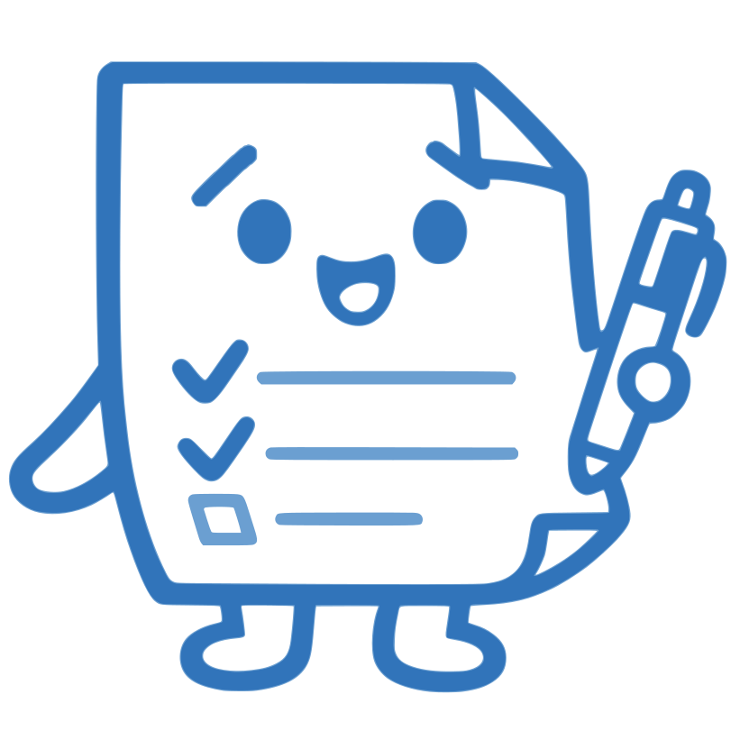

<div align="center">
  

  # Gizirotto（ぎじろっと）

  **家族の議事録 AI アシスタント**

  
  
  
  
  
</div>

## Demo

> デモ動画は準備中です。公開次第このページに掲載します。

## なぜ作ったか

議事録ツールの多くは「会社の会議」を主対象にしています。けれど、家族会議・月例の家計報告・子どもの予定共有といった「家庭の議事録」は、形式がゆるく、書き方も家庭ごとにバラバラで、続けるほど書式が揺れていきます。「前回はどう書いたっけ」と過去のファイルを探し、フォーマットを思い出すところから始まる——そんな小さな摩擦が、議事録を続けるハードルになっていました。

Gizirotto は **家族・少人数グループの議事録** という独自スコープに振り切ったアプリです。テンプレートに沿って AI が下書きし、家族の誰が書いても同じ書式で議事録が積み重なっていきます。会議のメモを箇条書きで渡せば、テンプレートに沿った清書が返ってくる、という体験を目指しています。

汎用の議事録 SaaS が「どの会社でも使える均一なフォーマット」を目指すのに対し、Gizirotto は逆に「その家庭らしさ」を残すことに価値を置いています。議事録が一定数溜まると、過去の書き方の癖（語尾・項目の並び・よく使う言い回し）を学習し、以降の下書きに活かします。テンプレートを覚えるだけでなく、書き方まで "その家らしく" 育っていくのが Gizirotto の目指すところです。

家庭の議事録は個人情報そのものなので、データは家族（世帯）単位で完全に分離して保存し、他の家庭からは一切見えません。なお、ここでいう「書き方の学習」はご家庭専用のデータとして Gizirotto 内に保存されるものであり、送信先の **AI サービス（Anthropic / Mistral）側の AI モデル自体の学習に使われることはありません**（詳細は [PRIVACY.md](./PRIVACY.md) を参照）。

## Features

- **テンプレートから議事録を作成** — 家族会議 / 子の予定 / 家計報告などの組み込みテンプレートに対応。独自テンプレート（Word / PDF / 画像）のアップロードからも項目構造を自動抽出します
- **チャット支援 or 手動入力** — AI とのチャット形式で会議メモを渡して下書きする方法と、自分で直接書く方法の両方に対応
- **Claude による自動整形** — テンプレートの書式に沿って、箇条書きのメモを議事録の体裁に整えます
- **WYSIWYG エディタ** — 出力前に PDF のレイアウトを画面上で確認しながら微調整できます
- **PDF 出力** — 家族の書式で揃った議事録を PDF として書き出します
- **画像テンプレート対応** — スマホで撮った紙の議事録用紙（JPG / PNG / WEBP）からもテンプレートを作成できます。議事録自体も「画像でダウンロード」ボタンから画像として書き出せます（複数ページは ZIP）
- **書き方を覚える機能** — 家族の議事録が 3 件以上溜まると、語尾や言い回しの癖を学習し、以降の下書きに活かします。設定画面から学習の ON/OFF 切り替え・学習し直し・学習データの削除ができます
- **ログアウト** — 共有の端末でも安心して使えるよう、設定画面から明示的にログアウトできます
- **アカウントの削除** — 設定画面から、確認ステップを経てご自身でアカウントを削除できます（削除されるデータの範囲は世帯構成によって異なります。詳細は [PRIVACY.md](./PRIVACY.md) を参照）

## Tech Stack

| 層 | 技術 |
|---|---|
| フロントエンド | Next.js 15（App Router）/ React 19 / TypeScript / Tailwind CSS |
| バックエンド | Next.js Server Actions / Route Handlers / Supabase Edge Functions |
| DB / 認証 / ストレージ | Supabase（PostgreSQL + RLS + Auth + Storage）|
| AI | Claude（整形・チャット）/ Mistral OCR（スキャン PDF）|
| PDF 処理 | pdfjs-dist / pdf-lib / @napi-rs/canvas / tesseract.js |
| ホスティング | Vercel |

設計思想・技術詳細は [ARCHITECTURE.md](./ARCHITECTURE.md) を参照してください。

## How It Works

1. **テンプレートを選ぶ** — 組み込みテンプレート、または自分でアップロードしたテンプレートから選択します
2. **議事録を書く** — 会議のメモを箇条書きで渡して AI に下書きさせるか、自分で記入します
3. **整形する** — Claude がテンプレートの書式に沿って、箇条書きのメモを議事録の体裁に整えます
4. **微調整して出力** — WYSIWYG エディタでレイアウトを確認・調整し、PDF として書き出します

座標変換（PDF ⇔ 画面）の真実を 1 モジュールに集約し、プレビューと最終出力のずれを防ぐ設計にしています。詳細は [ARCHITECTURE.md](./ARCHITECTURE.md) の「座標の真実マップ」を参照してください。

## これから

次に何を積み増すかは、家族会議ならぬ運営会議でじっくり検討中です。決まり次第このページでお知らせします。

## FAQ

**Q. 自分の家族のデータが、他の家庭に見られることはありませんか？**

A. ありません。データは世帯単位で完全に分離されており、他の家庭からは参照できません。技術的にも [PostgreSQL の Row Level Security](./ARCHITECTURE.md#7-データモデル) により DB レベルで保証しています。

## Getting Started

ローカルで動かす場合の最小手順です。

```bash
cd <project-root>/app
pnpm install
cp .env.example .env.local   # 各値を設定
pnpm dev                     # http://localhost:3000
```

- **前提**: Node.js 20 以上 / pnpm 9 以上
- **環境変数**: Supabase（PostgreSQL + Auth + Storage）への接続情報と、AI クライアント（Claude / Mistral）の API キーが必要です。`.env.example` をコピーして `.env.local` に各値を設定してください。API キーや接続情報はリポジトリには含まれていません
- **データベース**: Supabase のマイグレーションは `app/supabase/migrations/` にあります
- ローカル開発・テスト・マイグレーションの詳細手順は [`app/README.md`](./app/README.md) を参照してください

## Documentation

- [Architecture](./ARCHITECTURE.md) — 設計思想・技術詳細
- [License](./LICENSE) — MIT
- [Third Party Licenses](./THIRD_PARTY_LICENSES.md)
- [Security Policy](./.github/SECURITY.md)
- [Contributing](./.github/CONTRIBUTING.md)
- [Character Assets License](./app/public/character/LICENSE.md) — キャラクター画像（CC-BY-NC 4.0）

## License

ソースコードは [MIT License](./LICENSE) です。

ぎじろっとのキャラクター画像（`app/public/character/` 配下）は
**CC-BY-NC 4.0**（非商用利用のみ可）で別途ライセンスされています。
詳細は [public/character/LICENSE.md](./app/public/character/LICENSE.md) を参照してください。
